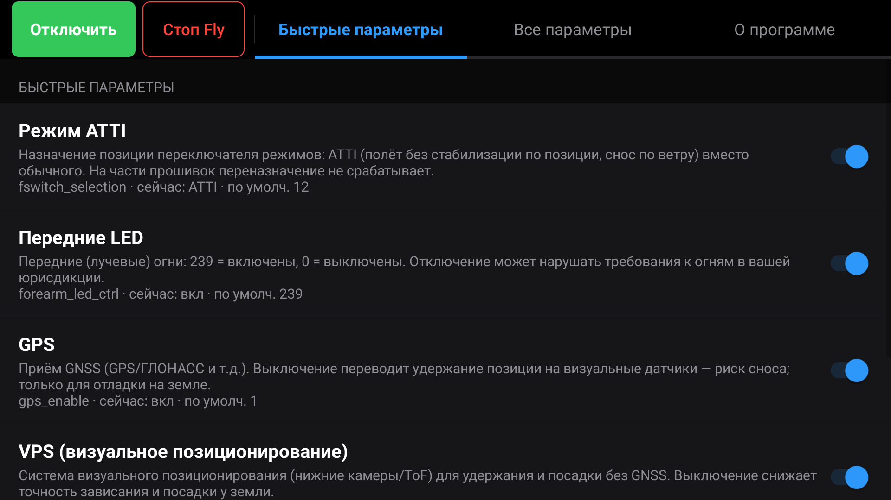
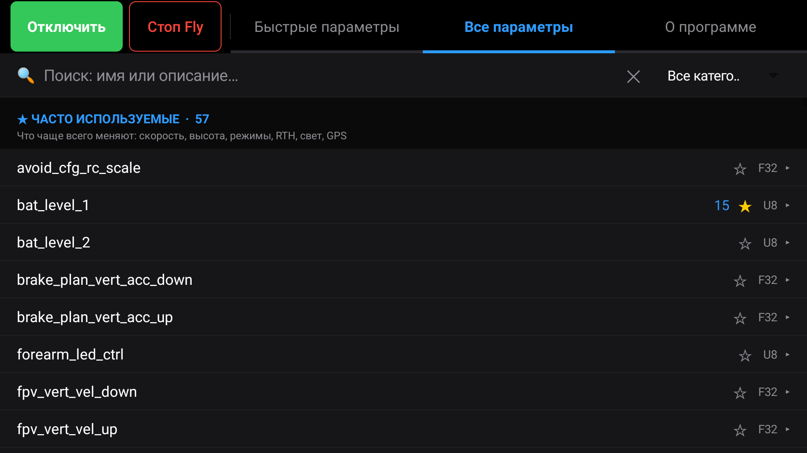
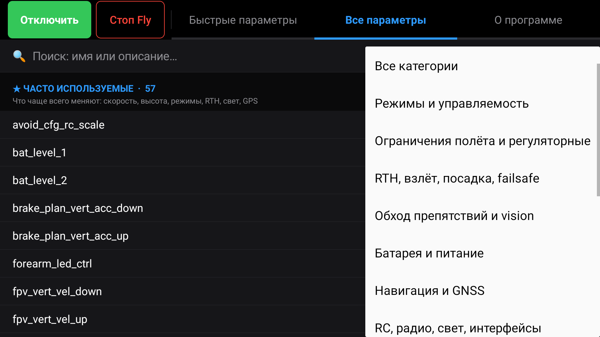

# DJI Param

**Редактор параметров полётного контроллера DJI-совместимых дронов — прямо на пульте.**

DJI Param — Android-приложение, которое ставится **на пульт DJI RC 2** и читает/пишет
параметры полётного контроллера (FC) борта по протоколу **DUML** через локальные сокеты пульта.
UI нативный, в тёмной теме DJI Fly. Приложение модельно-независимое: параметры сверяются
по **имени** (через `get_info`), а не по одному лишь индексу.

> **EN:** Flight-controller parameter editor for DUML-compatible drones. Runs on the DJI RC 2
> remote and talks to the aircraft over DUML via the controller's local loopback sockets.
> Native dark UI in DJI Fly style; read/write FC parameters with on-board name verification.

> ⚠️ **ОБЯЗАТЕЛЬНО перед использованием остановите все приложения на пульте, работающие с
> DUML-сокетами (в первую очередь DJI Fly).** DUML-канал пульта монопольный: приложение
> **конфликтует** с любым другим DUML-клиентом за сокеты `40007/40008`. Если DJI Fly (или иной
> DUML-клиент) остаётся активным, начинается churn сокетов — теряются ответы, а DJI Fly может
> аварийно закрыться. Штатная последовательность: **остановить DJI Fly → работать в приложении →
> снова запустить DJI Fly** (см. раздел [Сосуществование с DJI Fly](#сосуществование-с-dji-fly)).

> ⚠️ **Исследовательский инструмент** для собственного устройства и интероперабельности.
> Запись параметров опасна при активном полёте — выполняйте только на земле, когда дрон в покое
> и DJI Fly закрыта. Снятие лимитов высоты / региональных ограничений во многих юрисдикциях
> нарушает правила эксплуатации БВС — ответственность на пользователе.

---

## Возможности

- **Быстрые параметры** — готовые переключатели (режим ATTI/Cine, передние LED, GPS, VPS,
  лимиты высоты и т. п.) с чтением текущих значений и **readback-подтверждением** записи.
- **Все параметры** — поиск и постраничное чтение 950+ параметров с ленивой подгрузкой,
  рассчитанное на low-RAM экран пульта (рециклинг строк, без 950 View сразу).
- **Сверка имён с бортом** — перед записью имя параметра проверяется через `get_info`;
  защита от записи по неверному индексу на чужой прошивке.
- **Импорт дампов** двух форматов — `.dhv2params` (Drone-Hacks v2) и `.dhp`.
- **Пассивная идентификация борта** — серийник и кодовое имя модели ловятся из потока
  broadcast'ов без отдельного запроса.
- **Модельная независимость**: индекс параметра у каждой модели свой (`gps_enable`: 53 у Neo 2 …
  1403 у Flip), поэтому быстрые тумблеры резолвятся **по имени** через каталог модели
  (`assets/quick_index.json`, собран из дампов в [`params/`](params/)). Модель определяется
  автоматически по кодовому имени борта, с ручным выбором в верхней панели. Целевой борт —
  Lito X1 (`wa151`).

---

## Скриншоты

<table>
  <tr>
    <td width="33%"></td>
    <td width="33%"></td>
    <td width="33%"></td>
  </tr>
  <tr>
    <td align="center">Быстрые параметры — переключатели с текущими значениями и readback</td>
    <td align="center">Все параметры — поиск, избранное (★), чтение по тапу</td>
    <td align="center">Фильтр по категориям параметров</td>
  </tr>
</table>

_Экран пульта DJI RC 2 (1920×1080, ландшафт), тёмная тема в стиле DJI Fly._

---

## Как это работает

У борта нет своего USB/Wi-Fi — единственный путь к нему идёт **через пульт**: системный
DUSS-процесс на RC отдаёт DUML по loopback-сокетам. Роутер держит DUSS (не DJI Fly), поэтому
параметры доступны и с остановленной DJI Fly.

### Транспорт

| направление | сокет | назначение |
|---|---|---|
| запрос (inject) | `127.0.0.1:40008` | upstream к FC |
| ответ (read)    | `127.0.0.1:40007` | downstream-поток |

Один постоянный reader-тред слушает `40007`; `request()` инжектит запрос на `40008` и ждёт
ответ по совпадению `(cmd_set, cmd_id, index)`. Адреса: `src=0x02` (приложение),
`dst=0x03` (полётный контроллер).

### Кадр DUML v1

```
off size  поле
0   1     0x55                        SOF
1   1     length & 0xFF
2   1     (version<<2) | (length>>8)  version=1, длина 10-бит
3   1     CRC8(bytes[0:3], init=0x77)
4   1     src = (index<<5) | dev_type
5   1     dst
6   2     seq (u16 LE)
8   1     cmd_type/flags              запрос=0x40, ответ bit7=1
9   1     cmd_set
10  1     cmd_id
11  N     payload
-2  2     CRC16(bytes[0:-2], init=0x3692) LE
```

Тест-вектор CRC8: `55 0E 04 → 0x66`.

### Чтение / запись параметров FC

- `cmd_set = 0x03` (FLYCONTROLLER)
- `0xE1` get_info · `0xE2` read_value · `0xE3` write_value · `0xE0` count/attributes

```
read/write payload:  <table:u16> <unknown1:u16=1> <index:u16> [<value LE по типу>]
get_info   payload:  <table:u16> <index:u16>                        (без unknown1!)
reply:               <status:u32=0 OK> <index:u16> [<value>]
```

`get_info` возвращает реальное имя параметра с борта — используется для сверки таблицы и
защиты записи. Транспорт устойчив к одиночным потерям на busy-потоке `40007` (пейсинг +
повтор при потере); совпадение ответов — по монотонному seq, а не по индексу списка.

---

## Форматы файлов параметров

Приложение читает два формата дампов:

- **`.dhv2params`** (Drone-Hacks v2) — serde-JSON:
  `{version, params:[{name, table_number, param_index, param_type, data:{Integer|Float:{...}}}]}`.
  Типы: `F32, F64, U8, U16, U32, I8, I16` (LE по типу).
- **`.dhp`** — JSON-массив: `[{table_no, param_index, name, min, max, default, value, changed, type_id}]`.

> «Чистые» дампы мешают конфиг с device-specific калибровкой IMU/компаса. Приложение
> **не переносит** чужую калибровку на другой борт; список параметров привязан к прошивке/модели,
> поэтому имя всегда сверяется через `get_info`.

Встроенный каталог параметров — `assets/params.json` (имя, индекс, тип, диапазон, категория).
Дампы с нескольких моделей и сравнительный анализ — в [`params/`](params/).

---

## Архитектура

Нативная архитектура (View/Java), не WebView — легко для low-RAM устройства. Тёмная тема
в стиле DJI Fly, ландшафт, immersive fullscreen, крупные таргеты под палец.

```
.
├── AndroidManifest.xml
├── assets/params.json          каталог параметров (имя/индекс/тип/диапазон)
├── res/                        иконки, строки
├── src/com/djiparam/
│   ├── MainActivity.java        вкладки, UI, воркеры чтения/записи
│   ├── Duml.java                DUML-движок: framing, CRC, request/reply, идентификация
│   ├── DjiFly.java              сосуществование с DJI Fly (детект/остановка)
│   └── Logger.java              лог-панель
├── build.ps1                   сборка APK без gradle
├── deploy.sh                   сборка + деплой на пульт
└── tools/rc2sh.py              shell-мост по telnet
```

---

## Сборка

Сборка **без gradle** — цепочкой `aapt2 → javac → d8 → zipalign → apksigner`.

**Требуется:** Android SDK (build-tools + `platforms/android-34/android.jar`), JDK 11+.
Целевые уровни: `min-sdk 24`, `target-sdk 30`, arm64-v8a.

**Ключ подписи.** Нужен любой debug-keystore (в репозиторий он не входит). Создать локально:

```bash
keytool -genkeypair -v -keystore debug.keystore -storepass android -keypass android \
  -alias androiddebugkey -keyalg RSA -keysize 2048 -validity 10000 \
  -dname "CN=Android Debug,O=Android,C=US"
```

**Собрать:**

```powershell
# Windows PowerShell (пути к SDK/JDK/keystore — через переменные окружения, см. шапку build.ps1)
./build.ps1
```

Результат — `build/DjiParam.apk`. Один и тот же ключ ⇒ update-install поверх прошлой сборки
без удаления.

---

## Деплой на пульт

> ⚠️ **Требуется разблокированный пульт.** Установка опирается на системный shell с правами
> `system` (telnet-мост, `pm install -r -g`) и на **SELinux в режиме permissive** (иначе
> `pm install` не прочитает APK с FUSE `/sdcard`). На стоковом заблокированном пульте этого нет —
> сначала нужно разблокировать RC (например, комплектом от **Drone Tweaks** или аналогичным),
> получив системный shell и permissive-SELinux. Разблокировка пульта — вне рамок этого проекта;
> делаете на свой риск.

На пульте **нет adb** (USB-debugging выключён, Developer Options спрятаны, root отсутствует).
Обмен файлами — по **MTP**; установка — через системный shell пульта по **telnet** (busybox
`telnetd` под system-uid).

```bash
# переменные: RC2_HOST (ip пульта), RC2_MTP (путь к MTP-хелперу), RC2_DEVICE, RC2_STORAGE
RC2_HOST=<rc-ip> ./deploy.sh --build
```

Скрипт: собирает APK → пушит по MTP во внутренний накопитель (`/sdcard/DjiParam.apk`) →
ставит `pm install -r -g` через telnet-мост (`tools/rc2sh.py`). Если MTP-хелпер не задан —
скопируйте `build/DjiParam.apk` на пульт вручную и выполните шаг установки. Запасной путь —
ручной тап по APK на пульте.

> MTP-push реализуется внешним WPD/IFileOperation-хелпером (специфичным для окружения) —
> в этот репозиторий он не входит; путь к нему задаётся через `RC2_MTP`.

---

## Сосуществование с DJI Fly

Нельзя держать свой DUML-клиент и DJI Fly одновременно: роутер зеркалит FPV-видео во `40007`,
и churn нашего сокета роняет DJI Fly. Безопасная модель сессии:

> **Стоп DJI Fly → Подключиться (bulk read) → тумблеры (write + readback) → Старт DJI Fly.**

Никакого фонового авто-опроса; при паузе/выходе все сокеты закрываются.

---

## Безопасность и легальность

- Чтение (параметры, телеметрия, видео) — пассивно, с DJI Fly почти не конфликтует.
- **Запись опасна при активном управлении** → только на земле, дрон в покое, DJI Fly закрыта;
  в UI есть предупреждение и readback-подтверждение.
- Снятие лимитов высоты / региональных ограничений может нарушать местные правила БВС.
- Всё — для исследования **собственного** устройства и интероперабельности.

---

## Статус

В активной разработке. Транспорт DUML и сквозная запись параметров воспроизведены на живом
железе; идёт стабилизация чтения под нагрузкой и расширение таблицы параметров.

## Лицензия

См. [`LICENSE`](LICENSE).
